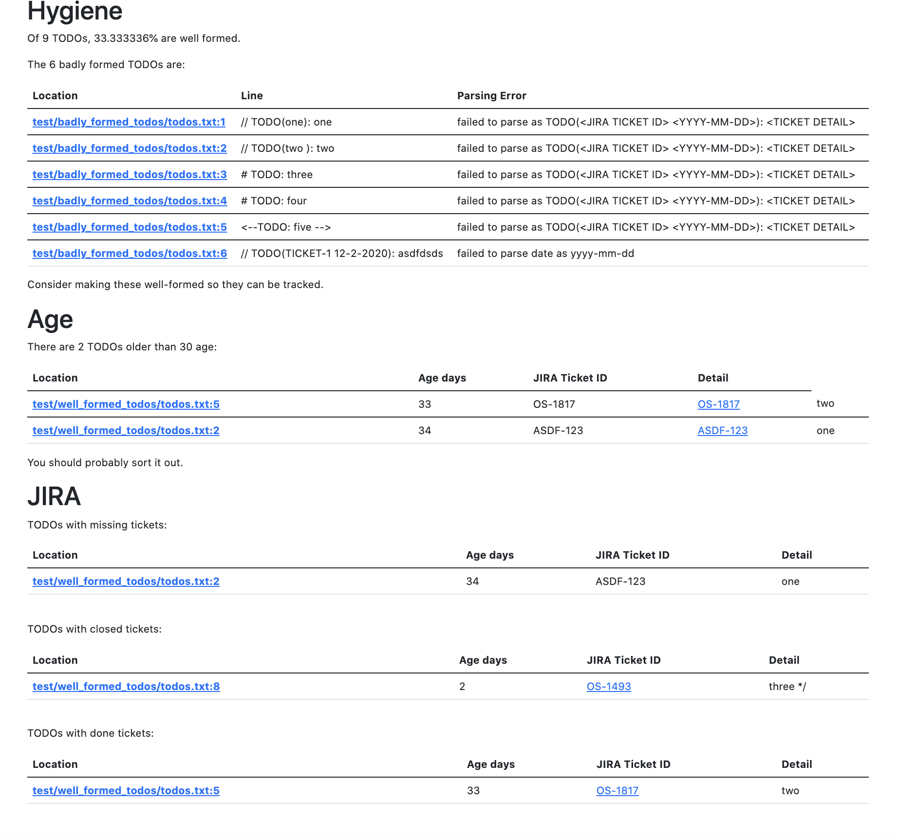

# TODO

A CLI tool that lets you keep on top of your TODOs.

Set up a `todo.yaml` config in the root of your repo:
```
# Glob patterns that will match with files containing your source code.
src_glob_patterns:
- src/**/*

# The number of days after which a warning is generated for a TODO.
warning_age_days: 30

# The base URL to your JIRA.
jira_address: "https://my.jira.com"

# The URL to your Github Repo for generating links to LOCs in the webpage.
jira_address: "https://github.com/neprune/todo/"
```

The tool works on TODOs in the form `TODO(<JIRA Ticket ID> <DATE YYYY-MM-DD>): <DETAIL>` - update some to this format in your repo.

Set `JIRA_USERNAME` and `JIRA_TOKEN` environment variables for credentials.

> You can generate a token for your JIRA [here](https://id.atlassian.com/manage/api-tokens).

Run `todo report web -o=index.html` to generate a static web page with links to LOCs in Github and the tickets in JIRA:




You can also run `todo report terminal` to see the report in terminal:
```
> todo report terminal

Hygiene Report:
===============

There are 9 TODOs in total.
33.33% TODOs are well formed.
The 6 badly formed TODOs are:

+--------------------------------+--------------------------------+--------------------------------+
|            LOCATION            |              LINE              |          PARSE ERROR           |
+--------------------------------+--------------------------------+--------------------------------+
| badly_formed_todos/todos.txt:1 | // TODO(one): one              | failed to parse as TODO(<JIRA  |
|                                |                                | TICKET ID> <YYYY-MM-DD>):      |
|                                |                                | <TICKET DETAIL>                |
| badly_formed_todos/todos.txt:2 | // TODO(two ): two             | failed to parse as TODO(<JIRA  |
|                                |                                | TICKET ID> <YYYY-MM-DD>):      |
|                                |                                | <TICKET DETAIL>                |
| badly_formed_todos/todos.txt:3 | # TODO: three                  | failed to parse as TODO(<JIRA  |
|                                |                                | TICKET ID> <YYYY-MM-DD>):      |
|                                |                                | <TICKET DETAIL>                |
| badly_formed_todos/todos.txt:4 |    # TODO: four                | failed to parse as TODO(<JIRA  |
|                                |                                | TICKET ID> <YYYY-MM-DD>):      |
|                                |                                | <TICKET DETAIL>                |
| badly_formed_todos/todos.txt:5 | <--TODO: five -->              | failed to parse as TODO(<JIRA  |
|                                |                                | TICKET ID> <YYYY-MM-DD>):      |
|                                |                                | <TICKET DETAIL>                |
| badly_formed_todos/todos.txt:6 | // TODO(TICKET-1 12-2-2020):   | failed to parse date as        |
|                                | asdfdsds                       | yyyy-mm-dd                     |
+--------------------------------+--------------------------------+--------------------------------+


Age Report:
===============

There are 2 TODOs older than 30 days.

+-------------------------------+---------+-------------+--------+
|           LOCATION            |   AGE   | JIRA TICKET | DETAIL |
+-------------------------------+---------+-------------+--------+
| well_formed_todos/todos.txt:5 | 33 days | OS-1817     | two    |
| well_formed_todos/todos.txt:2 | 34 days | ASDF-123    | one    |
+-------------------------------+---------+-------------+--------+


JIRA Report:
===============

TODOs with done issues:
+-------------------------------+---------+-------------+--------+
|           LOCATION            |   AGE   | JIRA TICKET | DETAIL |
+-------------------------------+---------+-------------+--------+
| well_formed_todos/todos.txt:5 | 33 days | OS-1817     | two    |
+-------------------------------+---------+-------------+--------+

TODOs with closed issues:
+-------------------------------+--------+-------------+----------+
|           LOCATION            |  AGE   | JIRA TICKET |  DETAIL  |
+-------------------------------+--------+-------------+----------+
| well_formed_todos/todos.txt:8 | 2 days | OS-1493     | three */ |
+-------------------------------+--------+-------------+----------+

TODOs with missing issues:
+-------------------------------+---------+-------------+--------+
|           LOCATION            |   AGE   | JIRA TICKET | DETAIL |
+-------------------------------+---------+-------------+--------+
| well_formed_todos/todos.txt:2 | 34 days | ASDF-123    | one    |
+-------------------------------+---------+-------------+--------+
```

You can also run assertions which can be useful for in local checks / CI:
* `todo assert only-well-formed-todos` asserts that there are no badly formed TODOs in source files.
* `todo assert no-old-todos` asserts that there are no TODOs older than the configured warning age.
* `todo assert consistent-with-jira` asserts that there are no TODOs with missing or completed tickets.

What's next:
* Make the webpage look better
* Turn into a plug and play GH action
* Turn into pre-commit

## Full Usage

```
> todo --help
usage: todo [<flags>] <command> [<args> ...]

A command-line tool for monitoring TODOs.

Flags:
      --help                   Show context-sensitive help (also try --help-long and --help-man).
  -c, --config=todo.yaml       The path to the config file.
      --jira-username=JIRA-USERNAME  
                               The username to use to login to JIRA.
      --jira-token=JIRA-TOKEN  The token to use to login to JIRA.

Commands:
  help [<command>...]
    Show help.

  assert well-formed-todos-only
    Fails if there are TODOs that don't conform to the expected format.

  assert no-old-todos
    Fails if there are any TODOs exceeding the warning limit..

  assert consistent-with-jira
    Fails if there are TODOs with non-existent or complete tickets.

  report terminal
    Output the report to terminal.

  report web [<flags>]
    Generate a static web page for the report.
```
